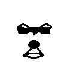

# AISC 2022 预赛code

## Method
主要方法来自于论文 https://arxiv.org/abs/2106.15058，
外加perceptual loss 以及feature loss 

生成模型使用TFace自己训练的模型：
TFace_IR101_Aug_glint360k,MXNET_LResNet100E_IR_SGM,TFace_DenseNet201_splitbn_faceemore_glintasia,TFace_MobileFaceNet_Aug_faceemore,TFace_MobileFaceNet_Aug_vggface2,TFace_MobileFaceNet_Aug_umd,TFace_MobileFaceNet_Aug_webface

训练数据集来自于InsightFace， 训练代码来自于TFace(https://github.com/Tencent/TFace)

## mask 
测试了很多种方法，最终选择了自己手绘的mask，如下：

## 测试脚本
run_generate.sh
